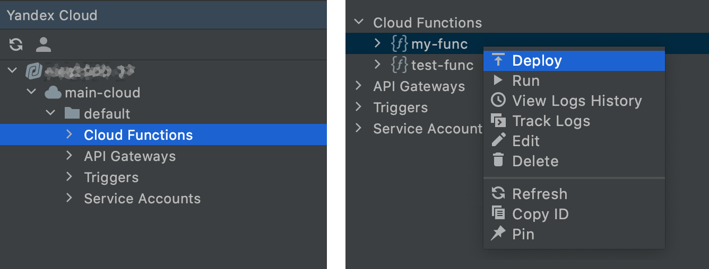

# Yandex Cloud Toolkit for the Intellij platform

The Yandex Cloud Toolkit plugin adds integration with [Yandex Cloud](https://cloud.yandex.com/) to the family of IDEs on the [IntelliJ platform](https://www.jetbrains.com/ru-ru/opensource/idea/) from [JetBrains](https://www.jetbrains.com).

## Scope

* [Resource Manager](https://cloud.yandex.com/docs/resource-manager/): Yandex Cloud resource management.
* [Cloud Functions](https://cloud.yandex.com/docs/functions/): Function management, loading versions, remote launch, viewing logs.
* [API Gateways](https://cloud.yandex.com/docs/api-gateway/): API gateway management, viewing and updating specs.
* [Service Accounts](https://cloud.yandex.com/docs/iam/concepts/users/service-accounts): Service account management, role assignment.

## Supported IDEs

All IDEs on the IntelliJ 2020.1+ platform.

## Installation

### Method 1. Plugin repository

1. Add the `https://github.com/yandex-cloud/ide-plugin-jetbrains/releases/download/latest/updatePlugins.xml` plugin repository to the IDE.
1. Search for and install the Yandex Cloud Toolkit plugin.

### Method 2. Installing from disk

1. Download or build the desired version of the Yandex Cloud Toolkit plugin.
1. Install the plugin to the IDE from disk.

## Usage

1. Use OAuth or the [Yandex Cloud CLI](https://cloud.yandex.com/docs/cli/) to log in to Yandex Cloud. To do this, open the `Yandex Cloud` window in the lower left-hand corner of the IDE and select or create a [Yandex Cloud account](https://cloud.yandex.com/docs/iam/concepts/#accounts). 
1. Resources will appear in the `Yandex Cloud` window. Select the desired resource and action from the pop-up menu. 

## Creating a build

To build the plugin, run the following Gradle job: `gradlew buildPlugin`

Build output: `./build/libs/yandex-cloud-toolkit-${version}.jar`

Additional Gradle jobs:

* `buildRepository`: Completes the plugin repository template.
* `printVersion`: Outputs the plugin version to use from GitHub Actions.

## Development

### Improvement

1. Add a new functionality.
1. Test the plugin by running the IDE via `gradle runIde`.
1. Update `CHANGELOG.md` for the `Unreleased` version in the right  [format](https://keepachangelog.com/en/1.0.0/).
1. Make a PR with the changes.

### Release

1. Increase the `pluginVersion` in `gradle.properties`.
1. Replace `Unreleased` with the new version in `CHANGELOG.md`.
1. If required, update the plugin description in `resources/pluginDescription.html` and `README.md`.
1. Submit the changes to the `origin/deploy` branch.
