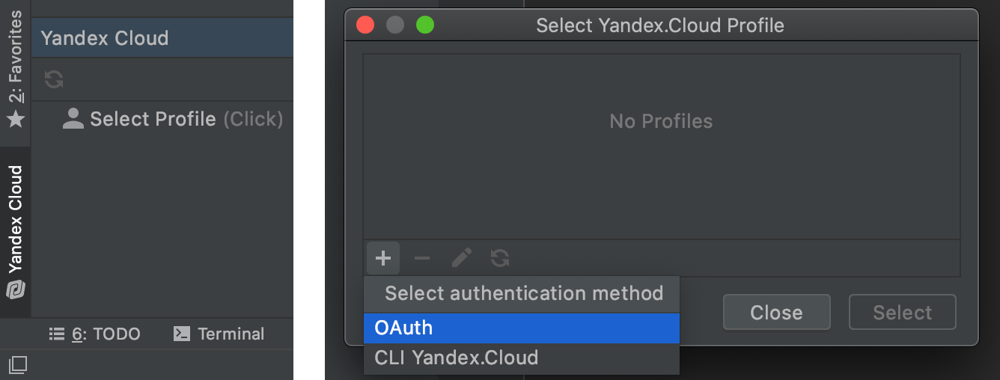

# Yandex.Cloud Toolkit для Intellij Platform
Плагин Yandex.Cloud Toolkit добавляет интеграцию с [Yandex.Cloud](https://cloud.yandex.ru/) в семейство IDE на [платформе Intellij](https://www.jetbrains.com/ru-ru/opensource/idea/) от [JetBrains](https://www.jetbrains.com).

## Возможности
* [Resource Manager](https://cloud.yandex.ru/docs/resource-manager/): Просмотр и управление ресурсами Yandex.Cloud 
* [Cloud Functions](https://cloud.yandex.ru/docs/functions/): Менеджмент функций, деплой версий, удаленный запуск, просмотр логов.
* [API Gateways](https://cloud.yandex.ru/docs/api-gateway/): Менеджмент API-шлюзов, просмотр и обновление спецификации.
* [Service Accounts](https://cloud.yandex.ru/docs/iam/concepts/users/service-accounts): Менеджмент сервисных аккаунтов, назначение ролей.

## Поддерживаемые IDE
Все IDE на платформе IntelliJ 2020.1+

## Установка

### Способ 1: Репозиторий плагинов
Для установки плагина требуется добавить в IDE репозиторий плагинов и найти через поиск плагин `Yandex.Cloud Toolkit`.

Основной репозиторий плагина для IDE:  
`https://github.com/yandex-cloud/ide-plugin-jetbrains/releases/download/latest/updatePlugins.xml`

### Способ 2: Установка с диска
Для установки плагина данным способом требуется скачать или собрать нужную версию плагина, а затем установить в IDE плагин с диска.

## Использование
1. Открыть окно `Yandex.Cloud` на левой стороне IDE, выбрать или создать профиль авторизации в облаке через OAuth или [CLI Yandex.Cloud](https://cloud.yandex.ru/docs/cli/).  

1. В окне `Yandex.Cloud` выбрать нужный ресурс в иерархии и выбрать действие из всплывающего меню.

   
## Сборка плагина
Сборки плагина осуществляется через запуск Gradle задачи:  
`gradlew buildPlugin`  
Результат сборки:  
`./build/libs/yandex-cloud-toolkit-${version}.jar`

Дополнительные Gradle задачи:
* `buildRepository` - заполняет шаблон репозитория плагина
* `printVersion` - выводит версию плагина для использования из GitHub Actions

## Разработка

### Доработка
1. Добавить нужный функционал
1. Протестировать плагин, запустив IDE через `gradle runIde`
1. Дополнить `CHANGELOG.md` для `Unreleased` версии, придерживаясь [формата](https://keepachangelog.com/en/1.0.0/)
1. Сделать PR с изменениями

### Релиз
1. Поднять версию (`pluginVersion`) в `gradle.properties`
1. Заменить `Unreleased` на новую версию в `CHANGELOG.md`
1. Если требуется, обновить описание плагина в `resources/pluginDescription.html` и `README.md`
1. Отправить изменения в ветку `origin/deploy`
